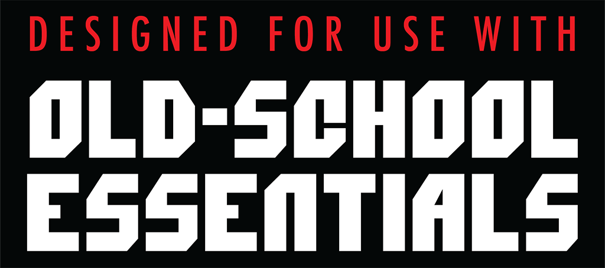
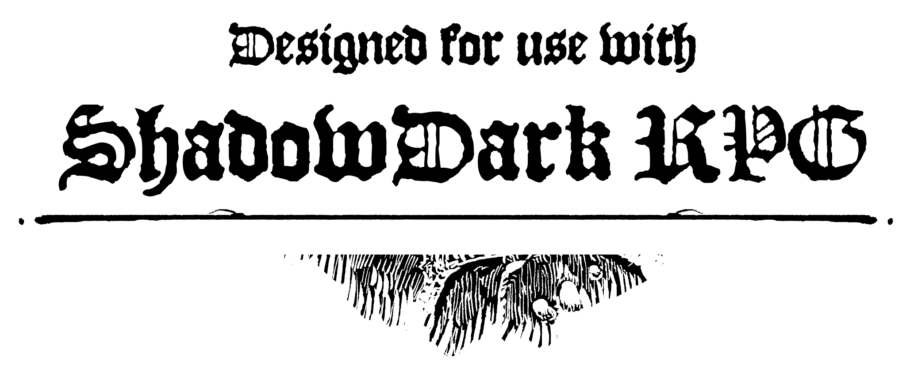

# OSR GENERATORS

<div>
  <h1 align="center">OSR Generators</h1>
  <strong>
    A collection of tools and generators for <a href="https://en.wikipedia.org/wiki/Old_School_Renaissance">OSR-style</a> TTRPG
  </strong>

  <div
    style="display: flex; flex-wrap: wrap;justify-content: space-evenly; align-items: center; background-color: #ffe647; padding: 10px 10px;"
  >
    
    <a href="https://necroticgnome.com/">
      
    </a>
      <a href="https://cairnrpg.com/">
      
    </a>
      <a href="https://morkborg.com/">
      
    </a>
    <a href="https://www.thearcanelibrary.com/pages/shadowdark">
      
    </a>
  </div>
</div>

<hr />

## Suppport

- [x] Knave 1e
- [ ] Knave 2e
- [ ] OSE
- [ ] Basic Fantasy RPG
- [ ] Outcast Silver Raiders
- [ ] Cairn
- [ ] Mork Borg
- [ ] Shadowdark

# Setup

## Prerequisites

- [asdf version manager](https://asdf-vm.com/)
- [asdf nodejs plugin](https://github.com/asdf-vm/asdf-nodejs)
- [yarn](https://yarnpkg.com/)

## Install nodejs

Use `asdf` to install the node version listed in `.tool-verisons`

```shell
asdf install
```

## Install dependencies

```shell
yarn
```

## Building

```shell
yarn build
```
